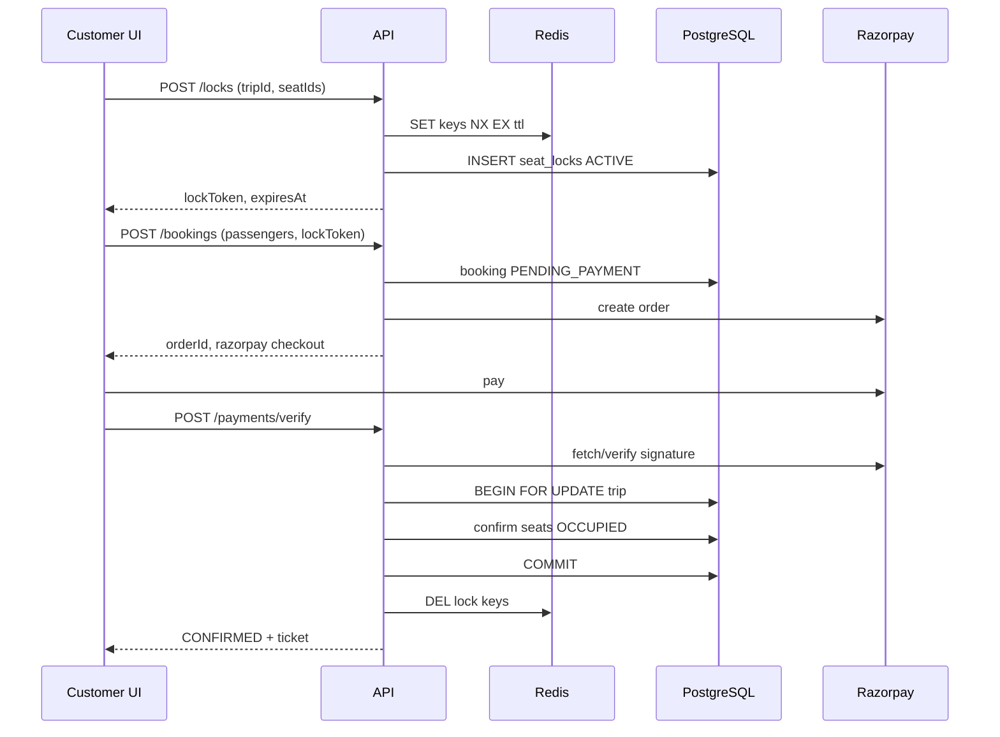

# Seat Locking & Concurrency Design

Goal: **no double booking** when multiple customers, agents, and admins book the same seat on the same trip at the same time.

Shiva Sakti uses **Redis (fast TTL)** + **PostgreSQL (authoritative on confirm)** + **partial unique indexes**.

---

## Actors and paths

| Path | Lock required? | Payment | Confirm |
|------|----------------|---------|---------|
| Customer online | Yes | Razorpay | After server verify |
| Agent online | Yes | Razorpay optional | After verify |
| Agent cash | Yes | CASH | Immediate confirm in one TX |
| Admin | Yes | varies | Role-guarded immediate confirm |

Agent cash must **immediately** remove seats from public availability — same lock + confirm flow as online, skipping payment pending state.

---

## Timeline (customer online)



If TTL fires before verify:

- Redis key gone → verify endpoint rejects
- Background job marks `seat_locks EXPIRED`, booking `CANCELLED` or `PENDING_PAYMENT` → failed

---

## Lock acquisition algorithm

**Input:** `trip_id`, `bus_seat_id[]`, `user_id`

1. Load trip; reject if trip not `SCHEDULED` or departure in past.
2. For each seat, in application code (ordered by `seat_id` to reduce deadlock):
   - **Redis:** `SET seatlock:{trip}:{seat} {lockToken} NX EX {ttl}`
   - If any `NX` fails → release all acquired Redis keys → return `409 SEAT_TAKEN`
3. **DB transaction:**
   - Check no `booking_seats` with `occupancy_status = 'OCCUPIED'` for those seats
   - Check no other `seat_locks` with `status = 'ACTIVE' AND expires_at > now()` (belt and suspenders)
   - Insert `seat_locks` rows; insert or update `bookings` status `SEATS_LOCKED`
4. Return `lock_token` and `expires_at` (from Redis TTL or `now() + company_settings.seat_lock_ttl_seconds`)

**Why both Redis and DB?**

- Redis gives automatic expiry without polling every second at scale.
- DB gives audit trail, admin visibility, and recovery if Redis flushed (reconcile job expires stale ACTIVE locks).

---

## Confirm algorithm (payment success or agent cash)

Single **Serializable** or **Repeatable Read** transaction (default Repeatable Read + unique index usually enough):

```
BEGIN;
  SELECT id FROM trips WHERE id = :tripId FOR UPDATE;

  -- Validate locks belong to this booking and not expired
  SELECT ... FROM seat_locks
    WHERE lock_token = :token AND status = 'ACTIVE' AND expires_at > now()
    FOR UPDATE;

  -- Validate payment if not CASH
  SELECT ... FROM payments WHERE booking_id = :bid AND status = 'CAPTURED';

  UPDATE bookings SET status = 'CONFIRMED', payment_method = :pm WHERE id = :bid;

  INSERT INTO booking_seats (..., occupancy_status) VALUES (..., 'OCCUPIED');
  -- Unique index uq_booking_seats_trip_seat_occupied prevents race

  UPDATE seat_locks SET status = 'CONVERTED' WHERE lock_token = :token;

  INSERT INTO tickets (...); -- queue PDF job after commit
COMMIT;
```

On `unique_violation` on `booking_seats`:

- Roll back
- Trigger refund if payment was captured (payment service)
- Return clear error to user

---

## Lock release

| Event | Redis | DB seat_locks | Booking |
|-------|-------|---------------|---------|
| User abandons | TTL | Job → EXPIRED | CANCELLED if draft |
| User clicks release | DEL | RELEASED | DRAFT/CANCELLED |
| Payment failed | DEL | EXPIRED | CANCELLED |
| Confirm success | DEL | CONVERTED | CONFIRMED |

---

## Agent vs customer fairness

- Same lock service for all roles; no “agent bypass” on locks.
- Agent cash calls `confirmBooking({ paymentMethod: CASH, source: AGENT_CASH })` immediately after lock + passenger details.
- **Commission row** inserted in same transaction after confirm.

---

## Idempotency

- `bookings.idempotency_key` from client header: if duplicate POST, return same booking response.
- Payment verify: use Razorpay `payment_id` unique constraint — second verify returns 200 with same result.

---

## Configuration (Shiva Sakti defaults)

Stored in `company_settings`:

| Setting | Suggested default |
|---------|-------------------|
| seat_lock_ttl_seconds | 600 (10 min) |
| payment_pending_ttl_seconds | 900 (15 min) |
| default_commission_cap_percent | 4.00 |

Admin can tune TTL without deploy.

---

## What we do not do in production

- Do not mark seats sold in the frontend after Razorpay callback only.
- Do not rely solely on Redis without DB unique index on occupied seats.
- Do not use “check then insert” without `FOR UPDATE` or unique constraint.

---

## Demo tracking (separate concern)

`tracking_source = 'DEMO'` must not affect seat or booking logic; only `tracking_points` / WebSocket feed.

Production GPS uses `GPS_DEVICE` with authenticated ingest API.
